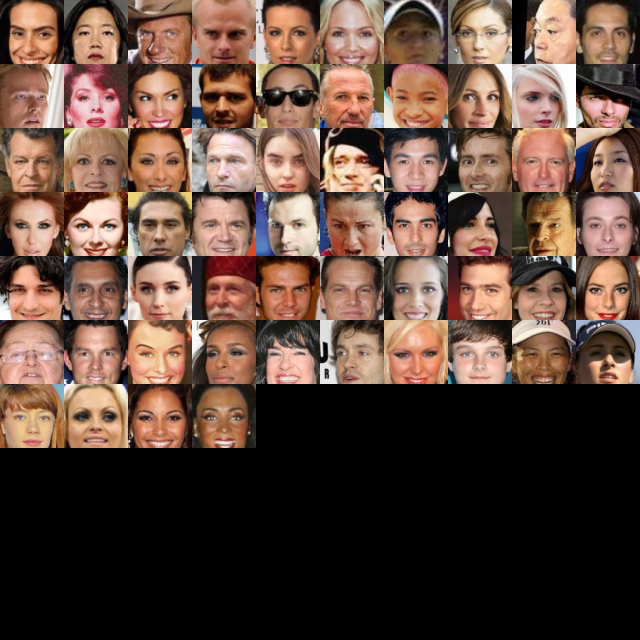
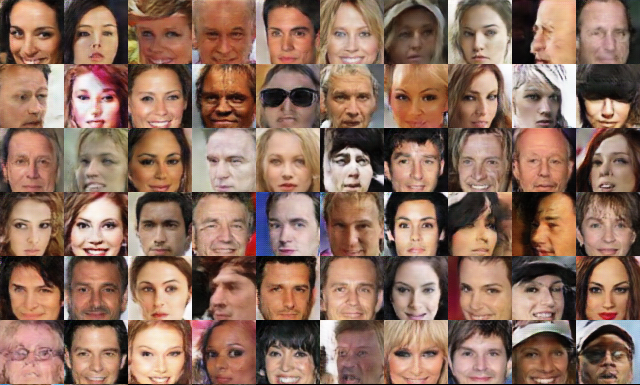

# VAE/GAN
the tensorflow code of [Autoencoding beyond pixels using a learned similarity metric](https://arxiv.org/abs/1512.09300v2)

The paper should be the first one to combine the Variational Autoencoder(VAE) and Generative Adversarial Networks(GAN), by 
using the discrimiator of GAN as the perceptual loss instead of the pixel-wise loss in the original VAE. VAE/GAN also can be used for image 
reconstruction and visual attribution manipulation.

# About training instability

I also found the training is very instability. So, I update the code to stablize the adversarial progress of VAE/GAN. The details is in the below.

- Add a trick, named label smoothing[Improved Techniques for Training GANs](https://arxiv.org/abs/1606.03498) 
- Adjust the learning rate from 0.0003 to 0.0001. 

## Prerequisites

- tensorflow >=1.4

## dataset requirement

You can download the [CelebA dataset](https://www.dropbox.com/sh/8oqt9vytwxb3s4r/AAB06FXaQRUNtjW9ntaoPGvCa?dl=0) 
and unzip CelebA into a directory. Noted that this directory don't contain the sub-directory.

## Usage
  
   Train:
    
    $ python main.py --op 0 --path your data path
  
  Test:
  
    $ python main.py --op 1 --path your data path

## Experiments visual result

 Input:
    
 
    
 Reconstruction
    
 
    
    
 ## Issue
 If you find the bug and problem, Thanks for your issue to propose it.
    

## Reference code

[DCGAN](https://github.com/carpedm20/DCGAN-tensorflow)

[autoencoding_beyond_pixels](https://github.com/andersbll/autoencoding_beyond_pixels)
